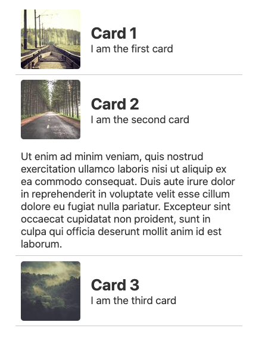

# Svelte Collapsible Card

[Check out the demo](https://svelte.dev/repl/17b43d9762c94ea5b5519016d0101bc6?version=3.29.7)



## Description

A card component that consists of a clickable header and variable height body. The card is opened and closed using css transitions.

Transitioning smoothly between heights while keeping the height flexible requires some Javascript. This component roughly follows the technique outlined in the css-tricks article linked below.

https://css-tricks.com/using-css-transitions-auto-dimension#technique-3-javascript

## Usage

```
npm i svelte-collapsible-card
```

```html
<script>

    import CollapsibleCard from 'svelte-collapsible-card'
    let open = false

</script>

<CollapsibleCard bind:open>
    <div slot='header'></div>
    <div slot='body'></div>
</CollapsibleCard>
```

To style the card you can either wrap it with an element that is used for styling, or you can pass down a class name.

```html
<CollapsibleCard className='card' />

<style>
    :global(.card) {
        border: 1px solid black;
    }
</style>
```
